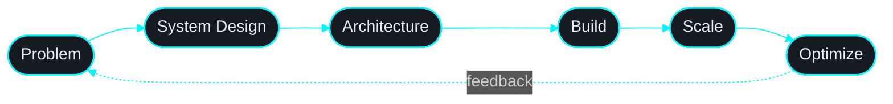

<!-- ╔══════════════════════════════════════════════════════════════╗ -->
<!--                    HEADER · WAVE + TYPING                    -->
<!-- ╚══════════════════════════════════════════════════════════════╝ -->

<a href="https://github.com/Vandu55">
  
</a>

<p align="center">
  <a href="https://github.com/Vandu55">
    
  </a>
</p>

<br/>

## `~/whoami`

```ts
const vandna = {
  role: "Software Engineer",

  focus: [
    "Full Stack Development",
    "System Design",
    "Backend Architecture",
    "Scalable Applications"
  ],

  building: [
    "Modern Web Applications",
    "REST APIs",
    "Interactive User Experiences"
  ],

  frontend: [
    "React",
    "Next.js",
    "Three.js",
    "Tailwind CSS"
  ],

  backend: [
    "Node.js",
    "Express.js"
  ],

  databases: [
    "MongoDB",
    "PostgreSQL"
  ],

  mindset: "clean code > quick fixes",

  fuel: [
    "learning",
    "building",
    "problem solving"
  ]
};
```

<br/>

## `~/stack`

<table>
<tr>
<td valign="top" width="50%">

### Frontend
<p>

</p>

### Backend
<p>

</p>

</td>

<td valign="top" width="50%">

### Database
<p>

</p>

### Tools
<p>

</p>

</td>
</tr>
</table>

<br/>

## `~/mindset`



<br/>

## `~/github-analytics`

<p align="center">
  
</p>

<p align="center">
  
</p>

<p align="center">
  
</p>

<p align="center">
  
</p>

<br/>

## `~/currently-learning`

```yaml
- System Design
- Scalable Backend Architecture
- PostgreSQL Optimization
- Three.js
- Modern Web Development
```

<br/>

## `~/connect`

<p align="center">
  <a href="mailto:vandnachahar771@gmail.com">
    
  </a>

  <a href="https://linkedin.com/in/vandana-chahar-9128aa257">
    
  </a>

  <a href="https://github.com/Vandu55">
    
  </a>
</p>

<br/>

<p align="center">
  <i><b>Code. Learn. Build. Repeat.</b></i>
</p>


