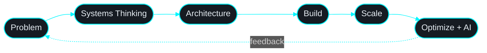

<!-- ╔══════════════════════════════════════════════════════════════╗ -->
<!--                    HEADER · WAVE + TYPING                      -->
<!-- ╚══════════════════════════════════════════════════════════════╝ -->

<a href="https://github.com/Vandu55">
  
</a>

<p align="center">
  <a href="https://github.com/Vandu55">
    
  </a>
</p>

<!-- <p align="center">
  
  
  
</p> -->

<!-- animated gradient line -->
<!--  -->

<br/>

<!-- ╔══════════════════════════════════════════════════════════════╗ -->
<!--                          ABOUT                                 -->
<!-- ╚══════════════════════════════════════════════════════════════╝ -->

## `~/whoami`

```ts
const aashutosh = {
  role:      "Software Engineer @ Bambinos.live",
  campus:    "Head Coordinator · Makerspace, NIT Raipur",
  focus:     ["scalability", "AI systems", "clean architecture"],
  building:  [".....always (chekc my contributions)"],
  mindset:   "systems > features",
  fuel:      ["chai", "Interstellar", "late-night commits"],
};
```

<br/>

<!-- ╔══════════════════════════════════════════════════════════════╗ -->
<!--                       ARCHITECTURE                             -->
<!-- ╚══════════════════════════════════════════════════════════════╝ -->


<br/>

<!-- ╔══════════════════════════════════════════════════════════════╗ -->
<!--                          STACK                                 -->
<!-- ╚══════════════════════════════════════════════════════════════╝ -->

## `~/stack`

<table>
<tr>
<td valign="top" width="50%">

**Frontend**
<p>

</p>

**Backend**
<p>

</p>

</td>
<td valign="top" width="50%">

**AI · Data**
<p>
<!--  -->


</p>

**Tools**
<p>

</p>

</td>
</tr>
</table>

<br/>

<!-- ╔══════════════════════════════════════════════════════════════╗ -->
<!--                        MINDSET                                 -->
<!-- ╚══════════════════════════════════════════════════════════════╝ -->

## `~/mindset`



<br/>

<!-- ╔══════════════════════════════════════════════════════════════╗ -->
<!--                       GITHUB STATS                             -->
<!-- ╚══════════════════════════════════════════════════════════════╝ -->

## `~/github-analytics`

<p align="center">
  <!--  -->
  
</p>

<p align="center">
  <!--  -->
  <!--  -->
</p>

<p align="center">
  
</p>

<br/>

<!-- ╔══════════════════════════════════════════════════════════════╗ -->
<!--                          SNAKE                                 -->
<!-- ╚══════════════════════════════════════════════════════════════╝ -->


<!-- ╔══════════════════════════════════════════════════════════════╗ -->
<!--                         CONNECT                                -->
<!-- ╚══════════════════════════════════════════════════════════════╝ -->

## `~/connect`

<p align="center">
  <a href="mailto:aashutoshpatelownstudy@gmail.com">
    
  </a>
  <a href="https://www.linkedin.com/in/aashutosh-patel/">
    
  </a>
  <a href="https://github.com/AashuPatel">
    
  </a>
</p>

<br/>

<!-- ╔══════════════════════════════════════════════════════════════╗ -->
<!--                          QUOTE                                 -->
<!-- ╚══════════════════════════════════════════════════════════════╝ -->

<!-- <p align="center">
  
</p> -->

<p align="center"><i>A cup of <b>Chai</b> ☕ can solve any bug.</i></p>

<!-- ╔══════════════════════════════════════════════════════════════╗ -->
<!--                          FOOTER                                -->
<!-- ╚══════════════════════════════════════════════════════════════╝ -->


